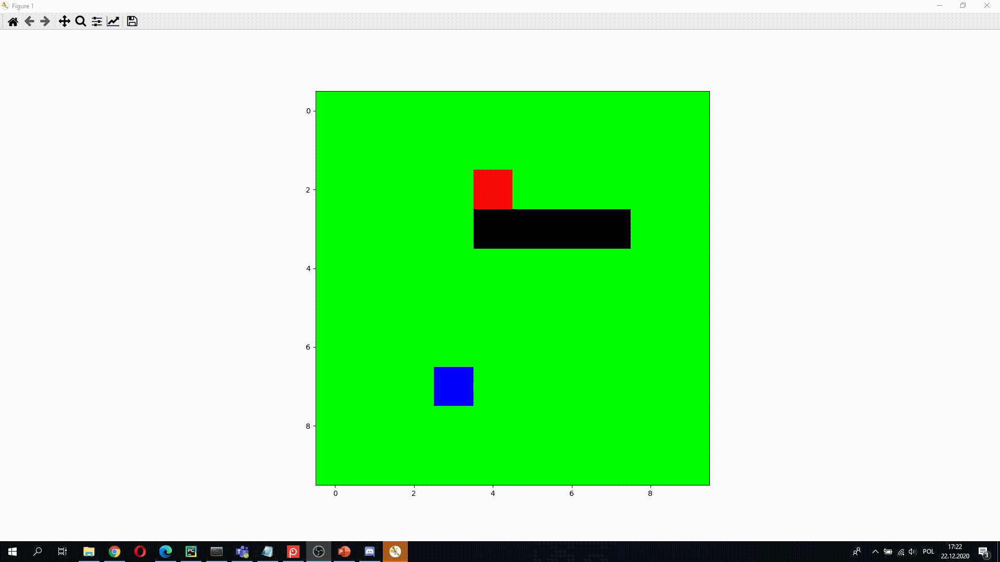

# Snake - deep reinforcement learning

## Used libraries
- tensorflow2
- gym_snake

## Description
Deep Q Learning project aimed to play a game called "snake".
The agent was self learning using 2 types of neural networks: classic neural networks (worked quite well) and convolutional neural networks (turned out to be a bad choice for the project).

After 3.5k games the average number of eaten apples was 10.37 (average of 50 games).

## Game demo

